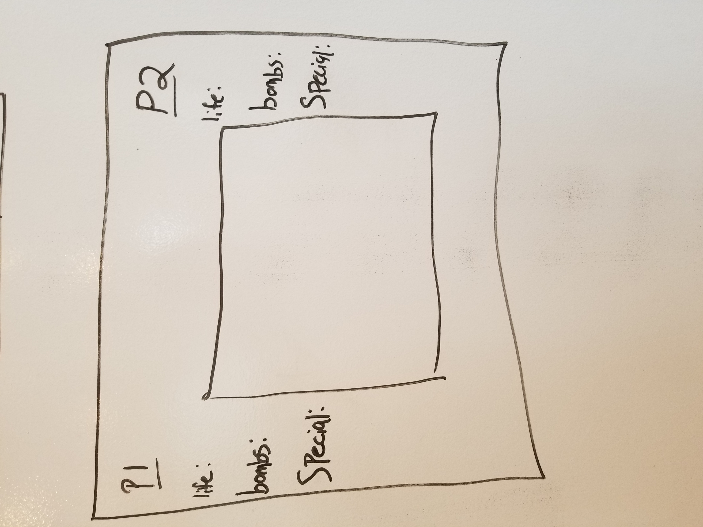
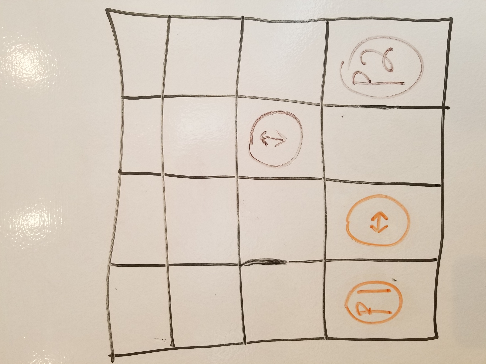
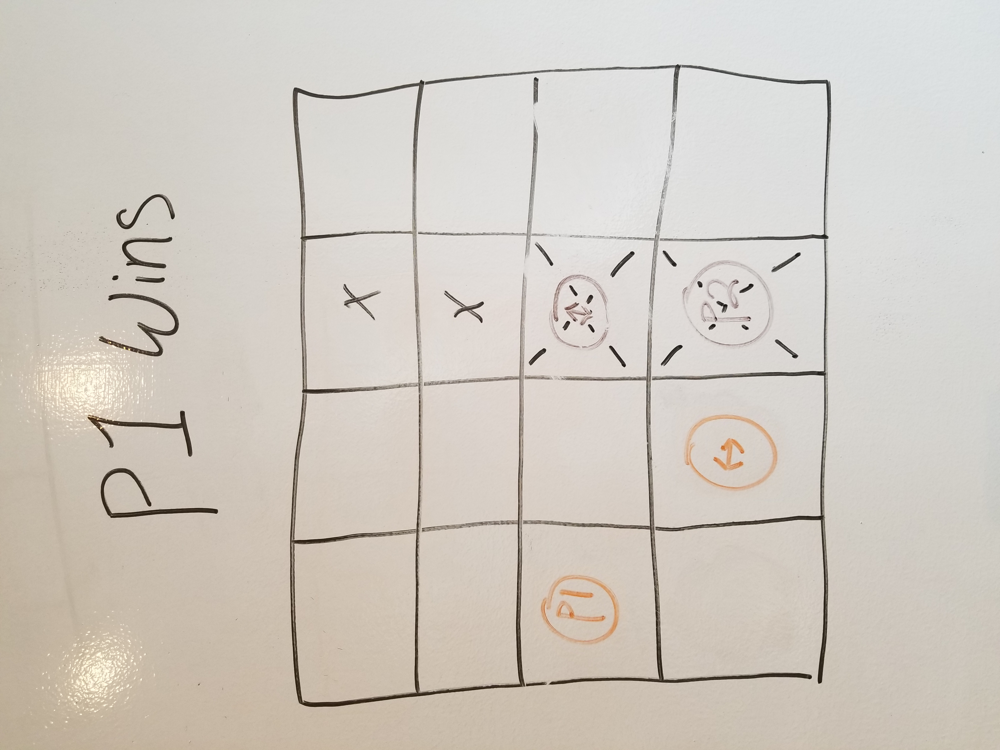

# Bomb-Wars
Bomber man inspired game

## Original Wireframes

## What is Bomb-Wars?

> Brief discussion of what the game is and why you chose to make it

##### Bomb-Wars is a game where you try and be the last player standing.

## Technical Discussion

> List of the technologies you're using (HTML, CSS, JavaScript)
* JavaScript
* CSS
* HTML

## User Story

* The user will be greeted with a clean screen and select start when they wish to play.
* The user will battle NPC's and against another player to achieve victory.
* Last player standing will be the winner. 

### Notes on Game Structure

> Code samples, description of challenges you overcame, etc.
* Switched from a functional to class and prototype style

### How to Play
* Player 1 Controls: 
    Move up, right, down, left: wdsa 
    Drop bomb: X
* Player 2 Controls: 
    Move up, right, down, left: Arrow Keys
    Drop bomb: L

## The Making of Bomb-Wars

> Any credits or notes you feel you should add
* Good practice with collision detection and manipulating the dom on a high level with many moving parts

## Opportunities for Future Growth

> If you had more time to work on your game, what would you do?
* Solve the mystery of the ghost blank div explosions.
* Add points for destruction.
* Make a single player version with random levels and difficulty settings. 
