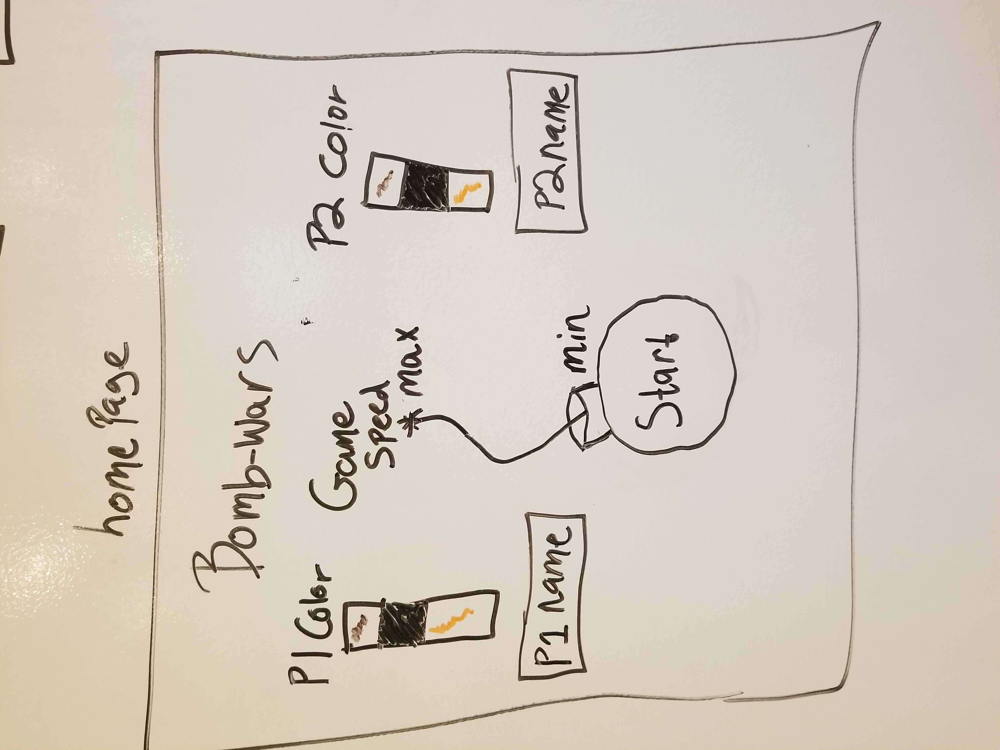
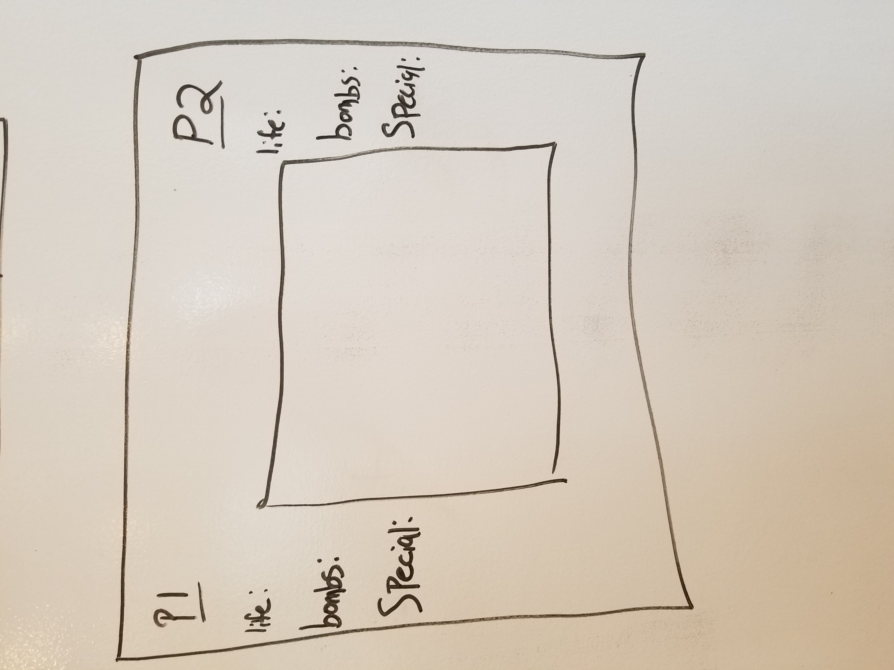
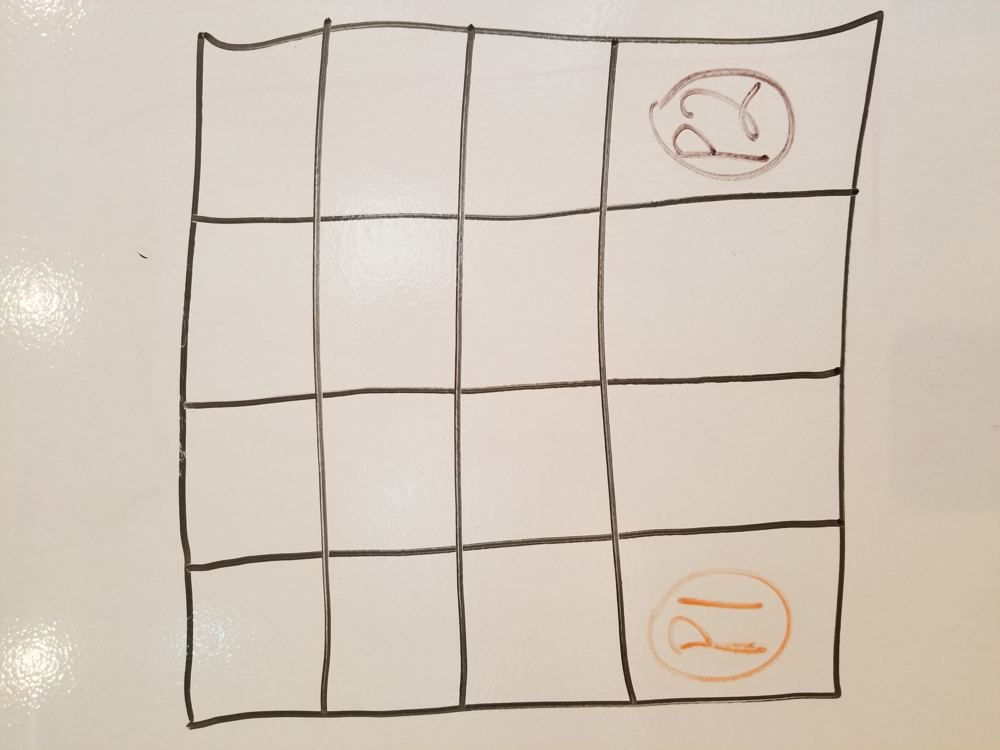
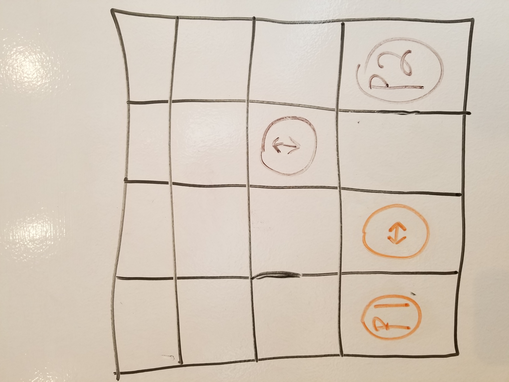
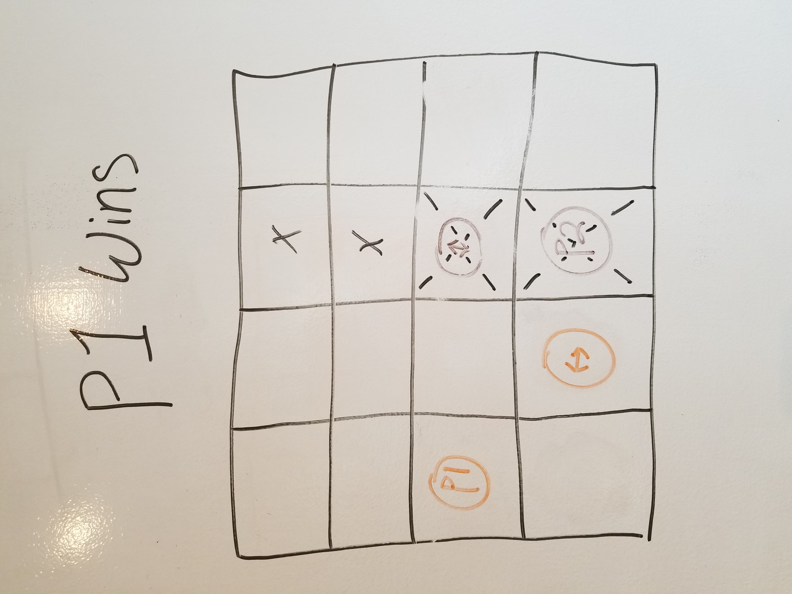

<!-- *** Name / Date *** -->
*** Brandon Hew / 7/11/2017 ***
# Bomber-Wars Proposal

<!-- ## What is [name of game]? -->
## What is Bomber-Wars?

<!--(Brief description of the game, why you're choosing to make it)-->
A game about trying to outsmart your oppoent with bomb placement. I chose to make it because I like strategy war games and this would be a simplified version of that. 

### Considerations
* no diagnal movements
* grid style
* having units
* real time

## Wireframe

<!-- (Your wireframes go here. Preferably two or more) -->

## Initial thoughts on game structure

<!-- (Write out what challenges you expect to encounter, or ideas you want to come up with) -->

Some potential issues when designing this might be ensuring that there will be a winner, or the map layout works well as I plan to randomize the maplayout obsticles. 

## Phases of Completion

<!-- (The steps or phases you expect to go through, and the tasks that you'll need to accomplish to reach each step. These should resemble the acceptance criteria we were working through earlier.) -->

* Game logic
* Gasic Display
* Working game
* Art

## Links and Resources

<!-- (Anything you've looked up so far or are thinking about using.) -->
